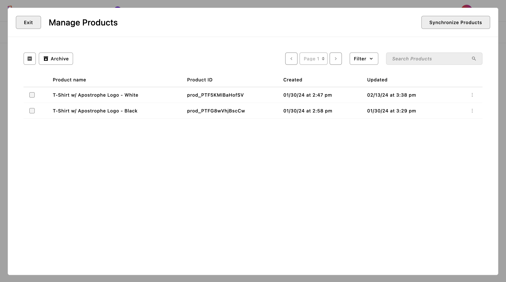
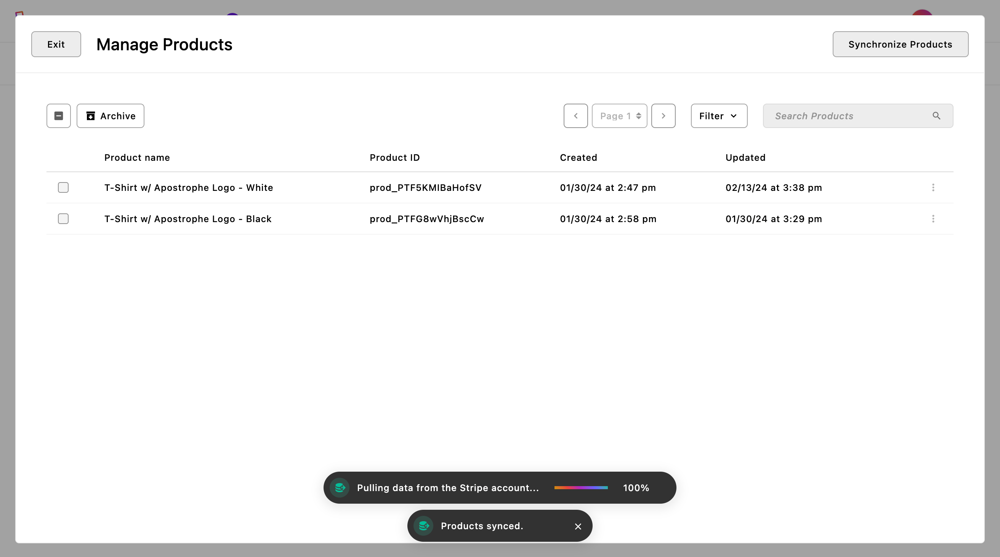
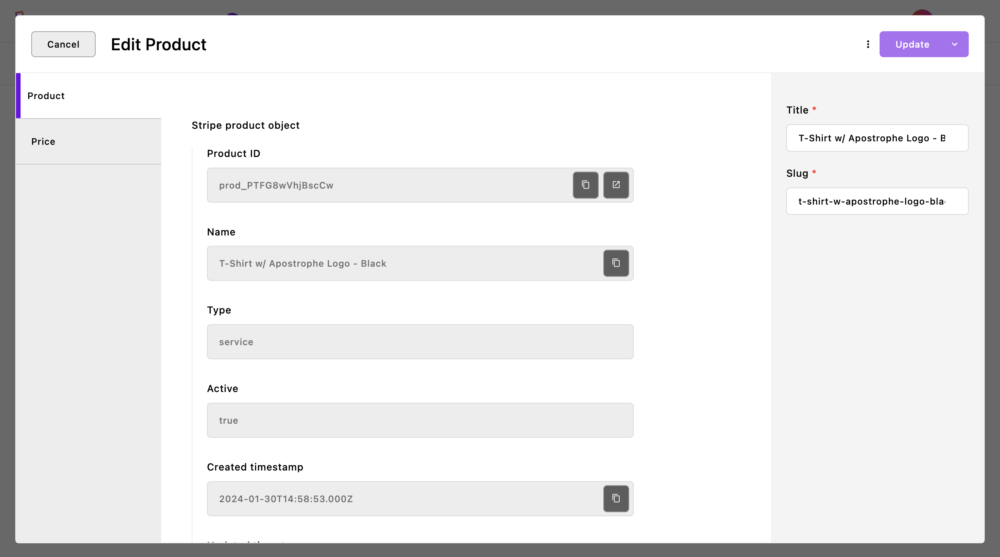
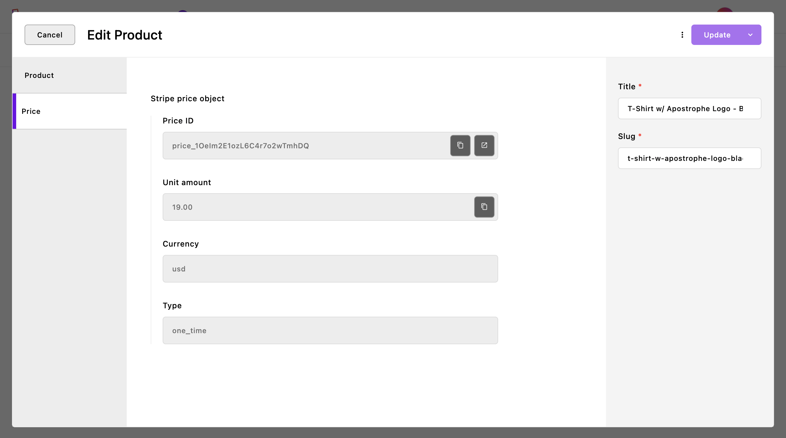

<div align="center">
    <h1>
        Stripe Products For ApostropheCMS
    </h1>
    <p>
        <a aria-label="Apostrophe logo" href="https://v3.docs.apostrophecms.org">
            
        </a>
        <a aria-label="Stripe logo" href="https://stripe.com">
            
        </a>
        <br>
        <a aria-label="Personal logo" href="https://stepanjakl.com">
            
        </a>
        <a aria-label="License"
           href="https://github.com/apostrophecms/module-template/blob/main/LICENSE.md">
            
        </a>
        <br>
        <br>
        <a aria-label="Unit Tests"
           href="https://github.com/stepanjakl/apostrophe-stripe-products/actions/workflows/tests.yml">
            
        </a>
    </p>
</div>

<br>

This module adds a piece module and utility operation to automatically synchronize Stripe Products with the database. Saved products can be easily accessed and viewed via the admin UI.

<br>

<table>
    <tr>
        <td colspan="3"><a href="./public/images/admin-1.png"></a></td>
    </tr>
    <tr>
        <td><a href="./public/images/admin-2.png"></a></td>
        <td><a href="./public/images/admin-3.png"></a></td>
        <td><a href="./public/images/admin-4.png"></a></td>
    </tr>
</table>

<br>

## Installation

Use your preferred package manager to install the module. You'll also need to install the [read-only-field](https://github.com/stepanjakl/apostrophe-read-only-field) package alongside it:

```zsh
npm install stripe-products@npm:@stepanjakl/apostrophe-stripe-products

npm install read-only-field@npm:@stepanjakl/apostrophe-read-only-field
```

<br>

## Examples

It is highly recommended to explore the [apostrophe-stripe-examples](https://github.com/stepanjakl/apostrophe-stripe-examples) repository, which offers a comprehensive set of examples and full configurations demonstrating how to set up a complete e-commerce store experience.

<br>

## Usage

First, add installed modules to your configuration in the `app.js` root file:

```js
require('apostrophe')({
    shortName: 'project-name',
    modules: {
        // Custom fields
        'read-only-field': {},

        // Stripe Products
        'stripe-products': {},
        'stripe-products/product': {}
    }
});
```

<br>

Then, set global variables inside the `.env` file. It's important to set the `STRIPE_TEST_MODE` variable to anything other than `false` to enable [test mode](https://docs.stripe.com/).

```js
PORT='4000'
APOS_BASE_URL='http://localhost:4000'
APOS_RELEASE_ID='a4-boilerplate'
APOS_MONGODB_URI='mongodb://localhost:27017/a4-boilerplate'

STRIPE_KEY='sk_test_xyz'
STRIPE_TEST_MODE='false'
STRIPE_DASHBOARD_BASE_URL='https://dashboard.stripe.com'
```

<br>

## API Routes

The `stripe-products` module contains a custom API route (`'/api/v1/stripe-products/synchronize'`) triggered by the `Synchronize Products` utility operation. It is executed through the `'@apostrophecms/job'` module. Once the job is completed, it saves the difference between the existing and received data to the results object in the `aposJobs` collection document.

<br>

## TODOs (Limitations)

- fix disappering `stripeProductObject` and `stripePriceObject` data when moved between `draft` and `published` modes and vice versa
- mention stripe-mock in the `README`
